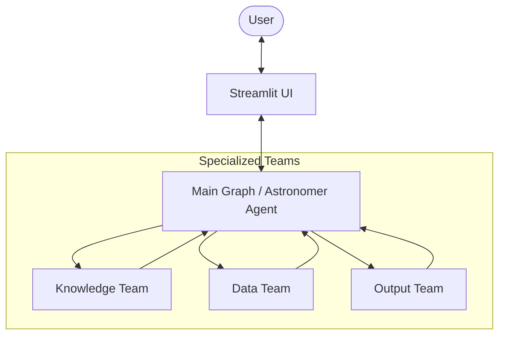
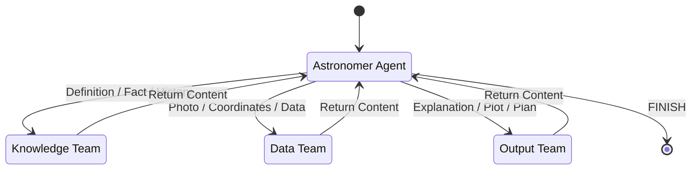
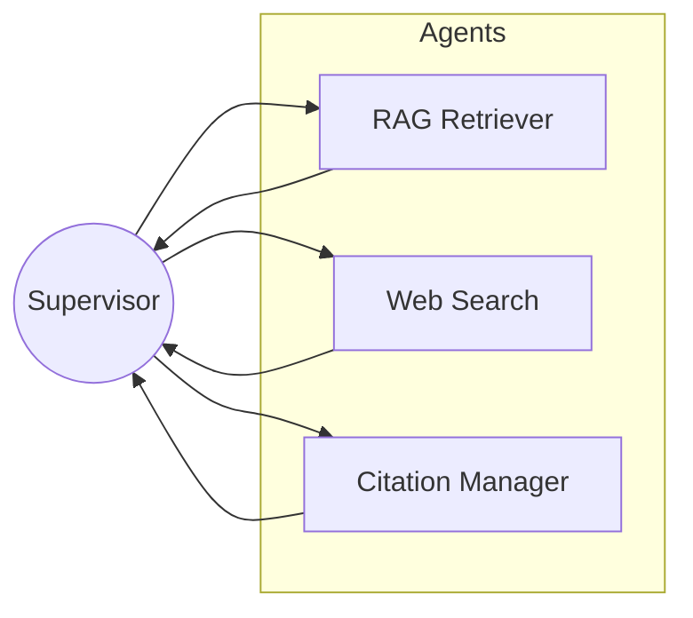
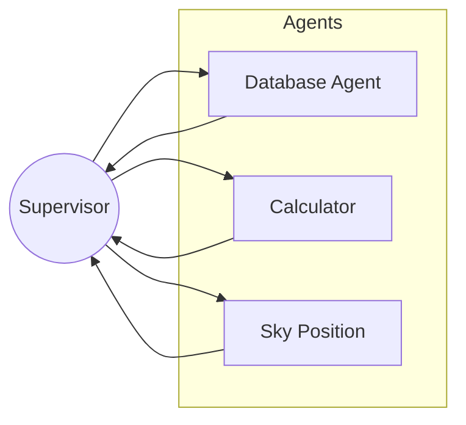
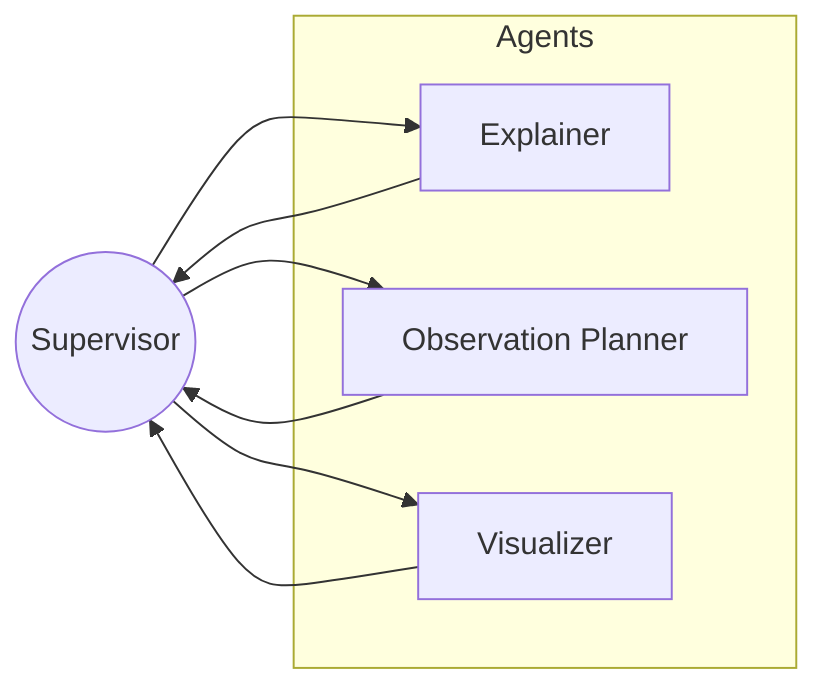

# 🏗️ Architecture: Multi-Agent Astronomy System

This document outlines the technical architecture of the Astronomy Multi-Agent System. The system is built using **LangGraph** for orchestration, **Google Gemini** as the reasoning engine, and **Streamlit** for the frontend.

## 🌟 System Overview

The system follows a **Hierarchical Agent Architecture**. A top-level "Astronomer" agent routes user queries to specialized sub-teams, each responsible for a specific domain.

## 🧩 Graph Workflows

### 1. Main Graph (`graphs/main_graph.py`)
The entry point for all queries. It assesses the user's intent and routes to the appropriate team.

### 2. Knowledge Team (`graphs/knowledge_team_graph.py`)
Handles retrieval from unstructured sources (PDFs, Web).

- **RAG Retriever**: Queries the local vector database (ChromaDB) created from PDFs.
- **Web Search**: Uses Tavily API for real-time information.
- **Citation Manager**: Formats sources.

### 3. Data Team (`graphs/data_team_graph.py`)
Handles structured data fetching and calculations.

- **Database Agent**: Fetches media and data from NASA APIs (Image Library, Mars Rover, Exoplanets).
- **Calculator**: Performs astrophysical calculations.
- **Sky Position**: Uses `ephem` or formulas to determine object visibility.

### 4. Output Team (`graphs/output_team_graph.py`)
Responsible for final presentation and visualization.

- **Explainer**: Generates text-based educational content.
- **Observation Planner**: Guides users on how/when to observe targets.
- **Visualizer**: Generates matplotlib/plotly charts and saves them as images for the UI to render.

## 💾 State Management
The system uses `TypedDict` schemas to pass state between agents.

- **Messages**: List of `BaseMessage` objects (history).
- **Astronomical Data**: Shared dictionary for raw data retrieved by the Data Team.
- **Location**: User's latitude/longitude for observation planning.
